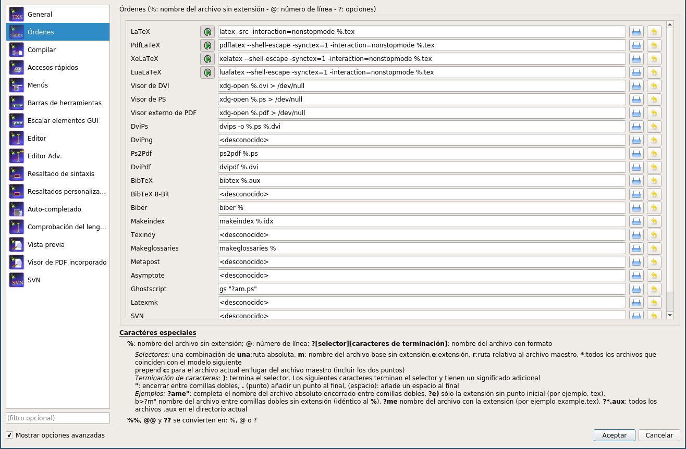

# dofiles-latex
LaTeX packages

## Debian installation

```console
apt install -y texstudio texlive-latex-extra texlive-lang-spanish \
texlive-latex-recommended texlive-fonts-recommended lmodern texlive-luatex \
texlive-xetex texlive-math-extra texlive-bibtex-extra texlive-fonts-extra
```
## Fedora installation

```console
dnf install texstudio texlive-collection-latexextra \
texlive-collection-latexrecommended texlive-collection-fontsrecommended \
texlive-collection-langspanish texlive-collection-luatex \
texlive-collection-xetex texlive-collection-mathextra \
texlive-collection-fontsextra texlive-collection-bibtexextra
```

Make sure you have installed ``pygmentize``

```console
pip install pygments
```

### Code::Blocks Style Highlighting

https://github.com/lecovi/codeblocks-pygments

## Book

https://en.wikibooks.org/wiki/LaTeX

## TexStudio options


